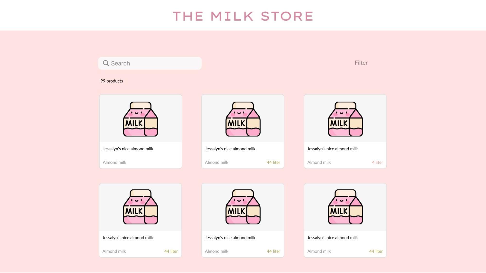
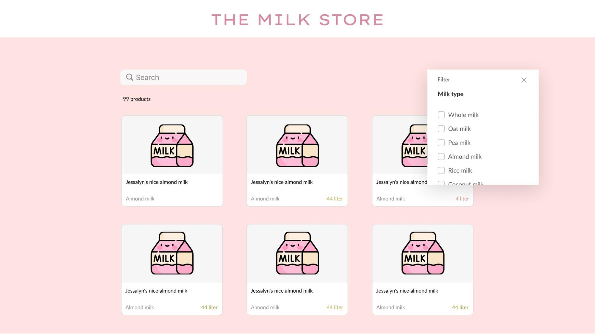
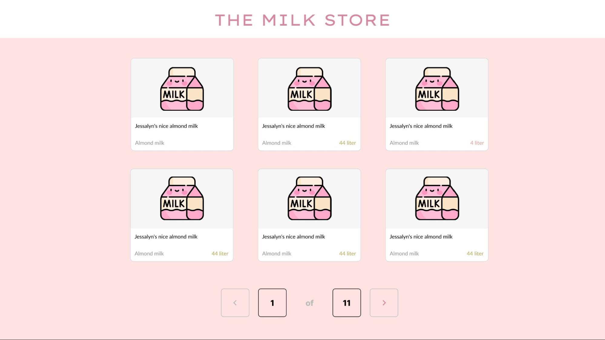
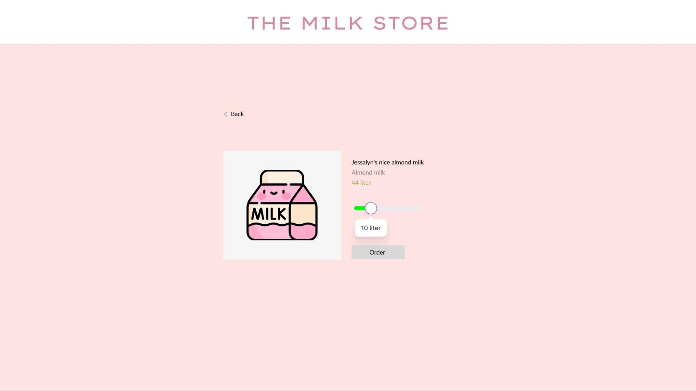

<html><head><meta content="text/html; charset=UTF-8" http-equiv="content-type"></head><body class="c14 doc-content">
PGP test Milk app - JSFS
<h2 class="c2" id="h.cln4moy53fbg">Background</h2><h2 class="c2" id="h.i3u63b875pzi">A small local milk shop needs your help desperately. Lately they started getting a lot of business, and they feel that they need a proper website to take a load off their store. The milk at this store is sold by the liter, and if you thought there was only one type of milk you are waay off! There will be several different types of milk, and you need to make sure that the customer can easily find the type they want! The requirements won&rsquo;t tell you everything, some parts you need to figure out yourself</h2><h2 class="c2" id="h.fug2pfyz7u9y">Technical requirements</h2><ul class="c1 lst-kix_3x69y27pwhwn-0 start"><li class="c9 li-bullet-0">Frontend: React &amp; TypeScript</li><li class="c17 li-bullet-0">Backend: Express &amp; TypeScript</li></ul><h2 class="c2" id="h.ghmb8fr3z6f8">Wireframe and design </h2><h2 class="c2" id="h.ogbkxyzfpquv">The owner of the shop sent a wireframe and design of the website for you to follow. You are allowed freedom in the design (styles, colors, fonts etc&hellip;), just try to keep the same layout. </h2>

<h2 class="c2" id="h.wq1x7j2kqu5f">Requirements</h2><ul class="c1 lst-kix_3x69y27pwhwn-0"><li class="c9 li-bullet-0">The milk data can be stored in the background, cope it from here: <a class="c20" href="https://www.google.com/url?q=https://github.com/saltstudy/pgp-test-milkApp-json&amp;sa=D&amp;source=editors&amp;ust=1674471222688200&amp;usg=AOvVaw0hycQkzHuTHFtnKCT6LERU">https://github.com/saltstudy/pgp-test-milkApp-json</a></li><li class="c9 li-bullet-0">Get the image from here:&nbsp;<a class="c20" href="https://www.google.com/url?q=https://drive.google.com/file/d/1yXbwm0TVpVgVncIplVSxbUfFvJPT0Elq/view?usp%3Dshare_link&amp;sa=D&amp;source=editors&amp;ust=1674471222688678&amp;usg=AOvVaw1wluTA6V4KV-rD9tdGcFIl">milk.png</a>, or use whatever image(s) you want!</li><li class="c9 li-bullet-0">A proper README, this should include background, how to run the app, etc&hellip; </li><li class="c9 li-bullet-0">As the customer enters the site they should be met with all the cards of milk that are in storage</li><li class="c9 li-bullet-0">A search bar where they can search based on name&nbsp;</li><li class="c9 li-bullet-0">A filter function that can filter out different types&nbsp;of milk; whole milk, oat milk, pea milk, almond milk, rice milk, coconut milk, soy milk, walnut milk, macadamia milk, hemp milk, cashew milk</li><li class="c9 li-bullet-0">The customer should be able to click on a card and be redirected to the product </li></ul><ul class="c1 lst-kix_3x69y27pwhwn-1 start"><li class="c10 li-bullet-0">Info should be displayed</li><li class="c10 li-bullet-0">A slider, or an number input, to choose how much liter they want to order</li><li class="c10 li-bullet-0">An order button. When this is clicked it should be clear that the order is done</li></ul><ul class="c1 lst-kix_3x69y27pwhwn-0"><li class="c9 li-bullet-0">Pagination, show 9 cards per page</li></ul><h2 class="c2" id="h.xv6cxeadydjv">Optional requirements</h2><h2 class="c2" id="h.4e7kxjux41w2">If you have time over here are some more parts you can add</h2><ul class="c1 lst-kix_3x69y27pwhwn-0"><li class="c9 li-bullet-0">A cart; maybe the customer wants many different types of products. So a cart and checkout page could be useful!</li><li class="c9 li-bullet-0">Deploy your application!</li><li class="c9 li-bullet-0">Put your data in a database of your choice</li></ul>

</body></html>